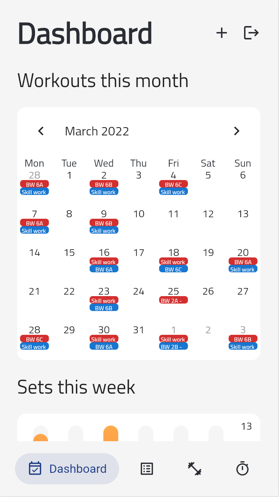
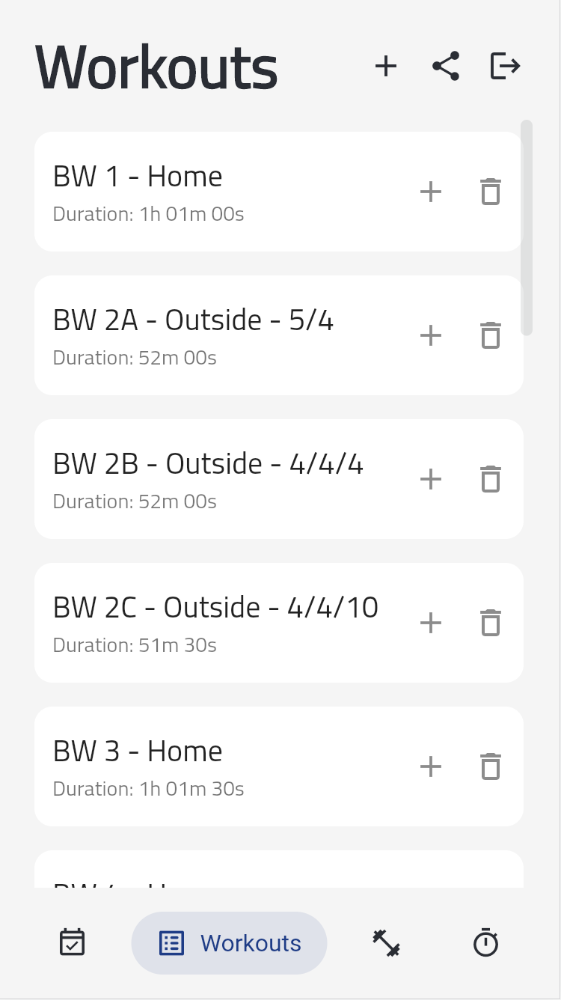
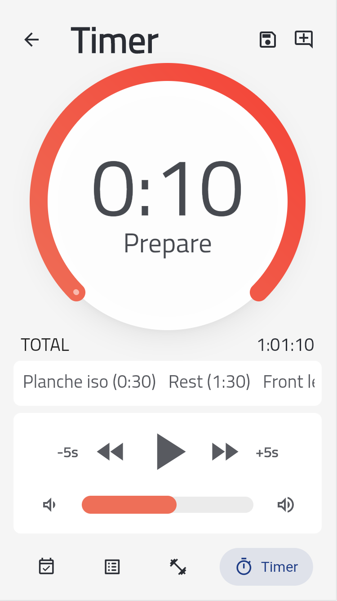

# Protalyze

A fast and simple workout app, to create custom timers, log your sessions, track your progress and share your workouts with friends. Built with Flutter and Firebase as its backend.

## 🚀 Pictures:

</img> 
</img> 
</img>

## 🚀 Technologies:
- Dart/Flutter: main programming language/framework.
- Firebase: authentication and database backend.
- Provider: state management.

## 🚀 Main features:
- Countdown timer for tracking your exercises and rest times on-the-go, with a very complete and intuitive UI design.
- Create your own exercises and workouts.
- Share your workouts with your friends.
- Log your past workouts.
- Analyse the sets per muscle groups worked each week.
- Track your progress.
- Secure email authentication.

## 🚀 Find it in:
- [Web](https://martinjedwabny.github.io/protalyze/)
- [Android](https://play.google.com/store/apps/details?id=com.mdjyapps.protalyze)

## For developers

- Web run instructions: 
  flutter run -d chrome
